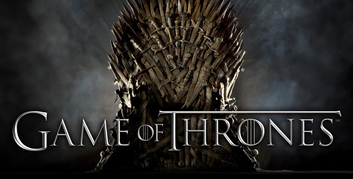

# **Game Of Thrones - Projeto de análise de dados**

 

 Projeto realizado ao final do Módulo 3 da formação de desenvolvimento Web Full-Stack da Resilia Educação. O projeto consistiu na realização de consulta de banco de dados MySQL e na montagem de gráficos a partir de queries. 

 

# **Tecnologias utilizadas:**

 

 

# **Plataformas de apoio:**

<ul>
<li>Power BI </li>
<li>Dbdiagram.io</li>
<li>VsCode</li>
<li>Trello </li>
</ul>

# **Colaboradores:**

      <h2>Carlos Eduardo  
        
        
      </h2>  
   

   
   

      <h2>Denise Oliveira  
        
        
      </h2>  
   

   
   

      <h2>Ivy Richa  
        
        
      </h2>  
   

   
   

      <h2>Matheus Camba  
        
        
      </h2>  
   

   

      <h2>Sabrina Couto  
        
        
      </h2>  
   

